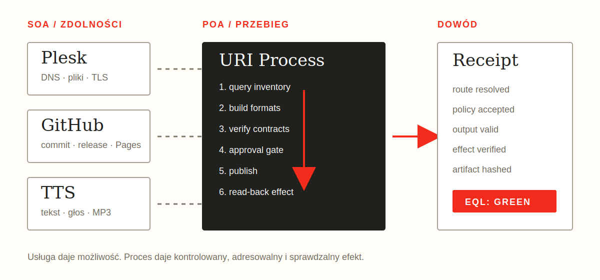

# Od SOA do POA: URI Process

Architektura zorientowana na usługi odpowiada na pytanie, **jaka usługa
udostępnia zdolność**. Architektura zorientowana na proces odpowiada na pytanie,
**jaki kontrolowany przebieg doprowadzi do oczekiwanego efektu**.

W tej książce używamy skrótu **POA** jako opisu architektury zorientowanej na
proces. Nie jest to oficjalna nazwa standardu `urirun`, lecz model pomagający
zrozumieć jego kontrakty.

| Wymiar | SOA | POA |
|---|---|---|
| jednostka | usługa | proces lub krok procesu |
| interfejs | endpoint API | typowany kontrakt wykonania |
| kompozycja | wywołania usług | plan, zależności i bramki |
| sukces | odpowiedź usługi | zweryfikowany efekt |
| lokalizacja | związana z wdrożeniem | ustalana przez routing |

POA nie zastępuje SOA. Długo działająca usługa nadal posiada cykl życia,
port, stan i endpointy. Proces składa zdolności jednej lub wielu usług w
operację, którą można zaplanować, autoryzować, wykonać i zweryfikować.

Badania nad wzorcami workflow pokazują, że kontrola przepływu, danych, zasobów
i wyjątków jest osobnym problemem względem implementacji pojedynczej usługi
[@vanderAalst2003workflow].

{fig-alt="Schemat SOA, POA i URI Process" width=100%}

## URI jest nazwą, nie transportem

RFC 3986 rozdziela identyfikację od interakcji: URI identyfikuje zasób, lecz
nie gwarantuje konkretnego sposobu dostępu [@rfc3986]. To rozdzielenie jest
podstawą URI Process. Adres:

```text
plesk://host/site/command/sync
```

nie mówi, czy wykonanie użyje lokalnej funkcji, HTTP, SFTP, kolejki czy zdalnego
node'a. Mówi, **jaki logiczny proces ma zostać wykonany**. Router wybiera
rzeczywisty runtime dopiero po sprawdzeniu registry, targetu i polityki.

Podobną korzyść daje jednolity interfejs REST: implementacja może ewoluować
niezależnie od udostępnianej zdolności [@fielding2000rest]. URI Process
przenosi tę zasadę z reprezentacji zasobów na wykonywalne operacje.

## Kontrakt procesu

Minimalny proces zawiera:

```json
{
  "id": "publish",
  "name": "Opublikuj wydanie",
  "actor": "system",
  "uri": "plesk://host/site/command/sync",
  "payload": {"source_dir": "dist"},
  "depends_on": ["verify"],
  "human_approval": true,
  "timeout_seconds": 120,
  "retries": 1
}
```

Kontrakt oddziela:

- tożsamość kroku,
- aktora,
- logiczny adres procesu,
- dane wejściowe,
- zależności,
- approval,
- zachowanie czasu i ponowień.

Lista takich obiektów tworzy mały DAG. Zależności są walidowane przed
wykonaniem, a cykl jest błędem kontraktu, nie problemem odkrywanym dopiero
podczas dispatchu.

## Od bindings do dowodu

```text
deklaracja connectora
  -> bindings + schema
  -> skompilowane registry
  -> routing diagnosis
  -> policy / grant
  -> dispatch przez adapter
  -> walidacja outputu
  -> EQL read-back
  -> journal + artifact
```

`query` oznacza operację tylko do odczytu. `command` oznacza możliwy efekt
uboczny i wymaga polityki wykonania. Sama obecność słowa `command` w URI nie
jest jednak wystarczającym zabezpieczeniem. Docelowo efekt powinien być również
typowanym polem kontraktu, aby bramka nie opierała decyzji wyłącznie na parsowaniu
tekstu adresu.

## Przykład publikacji

Publikacja strony może korzystać z wielu usług, lecz pozostaje jednym procesem
biznesowym:

```text
repo://host/release/query/inventory
  -> book://host/release/command/build
  -> test://host/release/query/verify
  -> plesk://host/site/command/release-upload
  -> plesk://host/site/command/release-verify
  -> plesk://host/site/command/release-activate
  -> https://public/site/query/fingerprint
```

Odpowiedź `ok: true` z uploadu oznacza jedynie poprawny dispatch. Dopiero
read-back publicznego fingerprintu jest dowodem opublikowanego efektu.

Kompletny przykład znajduje się w dołączonym pakiecie
`dsl/examples/uri-process-publication/`.

## Granice bezpieczeństwa

URI Process nie nadaje authority. Rozwiązywalna trasa mówi, że coś **może**
zostać wykonane technicznie, a nie że dany aktor **ma prawo** to wykonać.

Dlatego proces wymaga osobnych warstw:

1. AQL ogranicza aktora i klasy efektów.
2. Router potwierdza target oraz capability.
3. Grant wiąże zgodę z hashem planu i payloadu.
4. EQL sprawdza stan po wykonaniu.
5. Journal odróżnia dispatch od efektu.

LLM może wybrać proces wyłącznie z registry. Nie powinien wymyślać URI,
transportu, surowej komendy ani uprawnienia.

## Eksperyment

Wybierz proces, który obecnie jest pojedynczym skryptem lub runbookiem.

1. Rozbij go na kroki `query` i `command`.
2. Nadaj każdemu stabilny URI.
3. Zapisz zależności oraz wymagane approval.
4. Dodaj read-back efektu.
5. Uruchom najpierw w trybie dry-run.
6. Porównaj liczbę niejawnych założeń przed i po formalizacji.

Sukcesem nie jest większa liczba URI. Sukcesem jest proces, którego granice,
miejsce wykonania i efekt można wyjaśnić na podstawie kontraktu i receiptu.
