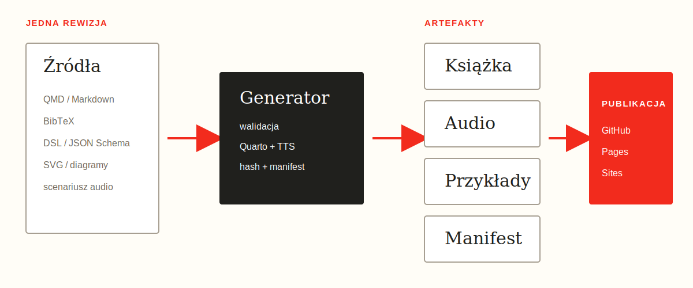

# Książka jako wykonywalny system publikacji

Książka jako kod nie kończy się na przechowywaniu rozdziałów w Git. Źródło
powinno deterministycznie zasilać wszystkie kanały:

```text
QMD + BibTeX + DSL + SVG
  -> walidacja
  -> HTML + PDF + EPUB + DOCX
  -> tekst narratora
  -> TTS + MP3
  -> manifest wydania
  -> GitHub Pages + landing page
```

{fig-alt="Diagram generatora książki, audiobooka i paczki przykładów" width=100%}

## Jedno źródło, różne projekcje

HTML służy do wyszukiwania i linkowania. EPUB daje płynny skład na czytniku.
PDF utrwala skład. DOCX jest formatem wymiany redakcyjnej. Audio jest odrębną
projekcją narracyjną, która usuwa tabele, kod i elementy czysto wizualne.

Generator nie powinien kopiować wiedzy ręcznie. Powinien:

- renderować wszystkie formaty z tej samej rewizji,
- pakować przykłady DSL,
- tworzyć manifest z rozmiarami i sumami SHA-256,
- podpisywać pochodzenie numerem wersji i commitem,
- publikować tylko po przejściu walidacji.

## Audio jako artefakt

Synteza mowy jest operacją zewnętrzną i kosztową. Tekst dzielimy w granicach
akapitów, a wynik każdego segmentu zapisujemy osobno. Manifest zachowuje nazwę
providera, głosu, modelu, liczbę znaków i informację o głosie syntetycznym.

Provider nie jest częścią treści. Ten sam tekst może zostać przetworzony przez
Google Cloud Text-to-Speech, OpenAI, ElevenLabs albo lokalny `espeak-ng`.
Wydanie testowe wykorzystuje lokalny provider, aby CI nie wymagało sekretów.
Wydanie produkcyjne może użyć Google lub innego API po dostarczeniu credentials.

## Reprodukowalność

Manifest wydania powinien umożliwić odpowiedź na cztery pytania:

1. Z jakiego commita powstał plik?
2. Jaki generator i provider go utworzył?
3. Czy plik zmienił się od czasu publikacji?
4. Czy wszystkie linki landing page prowadzą do tej samej wersji?

Dlatego suma kontrolna jest częścią produktu, a nie wyłącznie szczegółem CI.

## Test wydania

Przed publikacją:

```text
validate sources
  -> render book
  -> validate links and formats
  -> probe audio with ffprobe
  -> build application
  -> smoke test landing page
  -> commit and push
  -> deploy saved Sites version
```

Proces publikacji jest przykładem POA opisanym w poprzednim rozdziale: łączy
usługi, lecz jego jednostką sukcesu jest dostępne i zweryfikowane wydanie.
