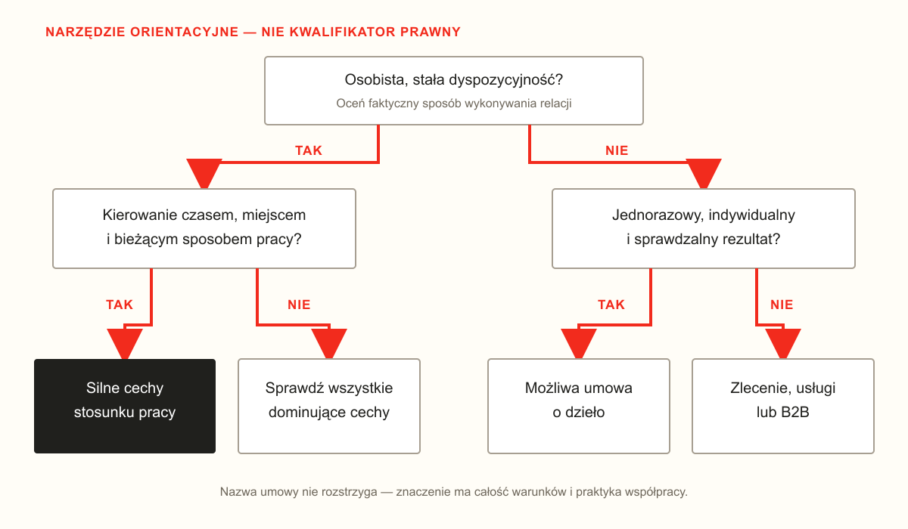
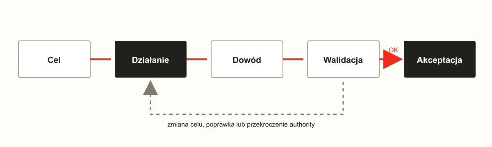

# Forma współpracy, authority i dowód pracy

::: {.callout-warning title="Zakres rozdziału"}
To materiał edukacyjny, nie porada prawna ani wzór umowy. Ocena zależy od
treści kontraktu i faktycznego sposobu współpracy. Stan źródeł sprawdzono
24 lipca 2026 r.; przed zastosowaniem należy ponownie sprawdzić akty prawne
i skonsultować konkretny przypadek.
:::

Najważniejsza korekta brzmi: **umowa zlecenia nie jest umową rezultatu**.
Zarówno stosunek pracy, jak i zlecenie opierają się zasadniczo na starannym
działaniu. Oznaczony rezultat jest centralny przede wszystkim dla umowy
o dzieło.

Nie oznacza to, że zleceniodawca nie może ustalać sposobu współpracy. Artykuł
737 Kodeksu cywilnego zakłada możliwość wskazania sposobu wykonania zlecenia,
a art. 740 wymaga udzielania potrzebnych informacji o przebiegu sprawy i
złożenia sprawozdania [@kodekscywilny2026].

## Główne formy współpracy

| Forma | Co faktycznie „kupuje” organizacja | Wpływ na sposób pracy | Co można kontraktować lub organizować | Główna walidacja |
|---|---|---:|---|---|
| **Umowa o pracę** | pracę określonego rodzaju, wykonywaną osobiście pod kierownictwem | duży | środowisko, procedury, kolejność, raportowanie, checkpointy, zgodne z prawem polecenia | staranność, proces, jakość i realizacja zadań |
| **Zlecenie / usługi** | staranne wykonywanie umówionych czynności | średni | zakres, instrukcje, standardy, informacje o przebiegu, dokumentację i bezpieczną infrastrukturę | należyte wykonywanie czynności zgodnie z umową |
| **Umowa o dzieło** | oznaczony, indywidualny i sprawdzalny rezultat | mały operacyjnie, duży przy odbiorze | specyfikację, format, termin, ograniczenia, testy odbiorowe i kamienie milowe | zgodność dzieła ze specyfikacją i kryteriami odbioru |
| **B2B** | usługę albo rezultat, zależnie od kontraktu | kontraktowy | SLA, standardy bezpieczeństwa, interfejs współpracy, artefakty, logi i kryteria odbioru | SLA, należyte wykonanie lub rezultat --- według umowy |
| **Praca tymczasowa** | pracę osoby zatrudnionej przez agencję | duży, ale podzielony | pracodawca użytkownik wyznacza zadania, organizuje pracę i kontroluje wykonanie | jak przy pracy, z ustawowym podziałem obowiązków |
| **Kontrakt menedżerski** | zarządzanie organizacją albo jej częścią | zależny od podstawy prawnej | mandat, cele, budżety, uprawnienia, KPI i raportowanie | należyta staranność, zgodność z mandatem i umówione wyniki |

B2B nie jest jednym nazwanym typem umowy. Opisuje relację przedsiębiorców,
pod którą może znajdować się świadczenie usług, dzieło, umowa agencyjna albo
kontrakt mieszany. Podobnie „kontrakt menedżerski” jest nazwą praktyczną; jego
charakter trzeba ustalić z konkretnej treści i sposobu wykonania. PIP podkreśla,
że B2B jest relacją niezależnych przedsiębiorców, a o kwalifikacji zatrudnienia
nie rozstrzyga sama etykieta dokumentu [@pipb2b].

## Lifecycle relacji

| Forma | Typowy cykl |
|---|---|
| **UoP** | rola i obowiązki → onboarding → przydzielanie pracy → wykonywanie poleceń → feedback i ocena → kolejne zadania albo zakończenie |
| **Zlecenie** | zakres czynności → instrukcje i warunki → staranne działanie → informacje o przebiegu → sprawozdanie i rozliczenie → kontynuacja albo wypowiedzenie |
| **Dzieło** | specyfikacja → kryteria odbioru → samodzielne wykonanie → dostarczenie → testy → odbiór lub poprawki → zapłata |
| **B2B** | umowa ramowa → zamówienie/SOW → SLA i ograniczenia → wykonanie → dowody i milestone'y → odbiór/faktura → odnowienie albo zakończenie |

Artykuł 627 Kodeksu cywilnego definiuje dzieło przez zobowiązanie do wykonania
oznaczonego dzieła. Zamawiający nie musi jednak ignorować wykonania: jeżeli
praca przebiega wadliwie albo sprzecznie z umową, art. 636 pozwala wezwać do
zmiany sposobu wykonania i wyznaczyć odpowiedni termin [@kodekscywilny2026].
Nie jest to automatycznie prawo do codziennego kierowania wykonawcą tak jak
pracownikiem.

## Ile może organizować pracodawca

Artykuł 22 Kodeksu pracy wiąże stosunek pracy z wykonywaniem pracy pod
kierownictwem pracodawcy oraz w wyznaczonym miejscu i czasie. Artykuł 100
wymaga pracy sumiennej i starannej oraz stosowania się do zgodnych z prawem i
umową poleceń dotyczących pracy [@kodekspracy].

Organizacja może zatem wymagać między innymi:

| Obszar | Przykładowa reguła procesu |
|---|---|
| środowisko | zadania wykonujemy w firmowym repozytorium i na zarządzanym urządzeniu |
| proces | każde zadanie przechodzi plan, wykonanie, test i review |
| dowody | zmiana stanu ticketu wymaga wyniku testu albo artefaktu |
| komunikacja | blokada przekraczająca ustalony czas uruchamia eskalację |
| jakość | zadanie nie jest ukończone bez testów i Definition of Done |
| kontrola | działanie wysokiego ryzyka wymaga akceptacji drugiej osoby |

Przy pracy tymczasowej pracodawca użytkownik wyznacza zadania i kontroluje ich
wykonanie, a agencja pozostaje pracodawcą. Ustawa rozdziela więc obowiązki
organizacyjne i formalne między dwa podmioty [@pracatymczasowa2023].

## Proces zamiast totalnego monitoringu

Prawo organizowania pracy nie oznacza nieograniczonego śledzenia człowieka.
Najbezpieczniejszy projekt systemu zapisuje **zdarzenia procesu i dowody
wykonania**, a nie każdy klik, treść prywatnej komunikacji czy ciągły obraz
ekranu.

UODO wskazuje, że monitoring musi realizować określony prawem cel, przejść test
niezbędności i proporcjonalności oraz ustąpić mniej inwazyjnemu środkowi, jeśli
ten pozwala osiągnąć ten sam cel [@uodomonitoring].

```text
preferowane:
  ticket.started
  test.completed
  approval.requested
  artifact.published

ryzykowne bez odrębnej podstawy i analizy:
  every.keystroke
  continuous.screenshot
  private.message.content
```

## Granica między UoP a relacją cywilną

{fig-alt="Drzewo pytań o dyspozycyjność, kierownictwo i rezultat" width=100%}

To drzewo jest narzędziem orientacyjnym, nie kwalifikatorem prawnym. Artykuł
22 Kodeksu pracy zabrania zastępowania umowy o pracę kontraktem cywilnym przy
zachowaniu warunków stosunku pracy [@kodekspracy]. PIP wymienia podporządkowanie,
osobiste świadczenie, powtarzalność, miejsce, czas i ryzyko pracodawcy jako
istotne cechy, które trzeba oceniać łącznie [@pipformy].

## Wniosek dla modelu actor/agent

**Forma prawna wpływa na zakres authority, ale jakość wytwarza protokół pracy.**

```text
ticket
  goal: oczekiwany stan końcowy
  authority: dozwolone działania
  constraints: środowisko, bezpieczeństwo, budżet
  checkpoints: kiedy potrzebna jest walidacja
  evidence: jakie zdarzenia i artefakty należy zapisać
  acceptance: walidowalne kryteria ukończenia
  escalation: kiedy actor musi oddać decyzję
```

{fig-alt="Pętla walidacji z powrotem do działania przy żądaniu zmiany" width=100%}

Na UoP pracodawca może tę pętlę w dużym stopniu organizować w granicach prawa
i umowy. Przy zleceniu lub B2B powinna wynikać z umówionego protokołu
współpracy. Przy dziele koncentruje się przede wszystkim na specyfikacji,
ryzykach, wykrywaniu wadliwego wykonania i odbiorze oznaczonego rezultatu.

Ciągła walidacja kosztuje zlecającego, ale część kosztu można przenieść do
automatycznych testów. Człowiek uczestniczy wtedy głównie przy wyjątku, zmianie
celu, przekroczeniu authority albo działaniu wysokiego ryzyka.
